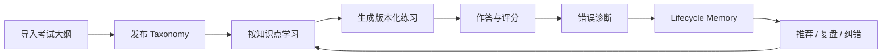
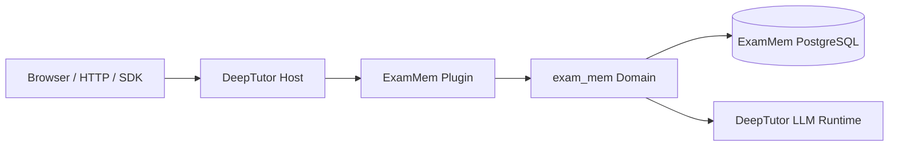

<p align="center">
  
</p>

<h1 align="center">ExamMem</h1>

<p align="center">
  构建在 DeepTutor 之上的垂类智能备考系统：把考试大纲、知识点学习、版本化练习、判题诊断和长期学习记忆连接成一个可恢复、可审计的闭环。
</p>

<p align="center">
  <strong>Taxonomy</strong> · <strong>Recoverable Practice</strong> · <strong>Lifecycle Memory</strong> · <strong>First-party Plugin</strong>
</p>

## ExamMem 是什么

通用 AI 助手可以讲解知识，也可以临时生成题目，但通常不知道用户正在准备哪场考试、某道题属于哪个知识点，以及一次错误在长期学习中意味着什么。

ExamMem 将用户导入的考试大纲解析成稳定的知识结构，让学习会话、练习、评分、诊断、记忆和下一步推荐始终归属同一学习计划与知识点。用户可以从一个知识点开始学习，进行多次版本化检测，再通过复盘和记忆纠错持续推进备考。

## 核心功能

| 能力 | ExamMem 的实现 |
| --- | --- |
| 考试大纲与 Taxonomy | 从 PDF、TXT、Markdown 或公开 URL 导入大纲，形成“学习计划 → 科目 → 章节 → 知识点”的已发布考试范围 |
| 知识点学习 | 从知识点进入 DeepTutor 对话，并固定学习计划、Taxonomy 版本和知识点上下文 |
| Practice / Assessment | 按已发布范围生成练习；同一 assessment 支持多个不可变版本和多次作答 |
| Grade & Diagnosis | 结构化保存评分、理由、错误模式和知识点诊断，而不是只返回一段临时文本 |
| Lifecycle Memory | 用 L1/L2/L3 保存证据、当前学习状态和可重建综合，保留 provenance 与版本链 |
| Recommendation / Review / Correction | 根据学习状态推荐下一步；按考试、版本和作答复盘，并通过追加式复核修正错误记忆 |

Browser、HTTP API 和 Python SDK 共用同一套插件能力与 PostgreSQL 领域存储。

## 产品闭环



这不是几张独立页面的拼接：练习选择的知识点来自已发布 Taxonomy，评分结果进入同一 Scope 下的学习记忆，推荐和复盘再读取这些可追溯证据。

## 系统模块

| Module | Responsibility |
| --- | --- |
| Taxonomy | 管理学习计划、考试科目、章节、知识点和发布版本 |
| Learning | 建立知识点与 DeepTutor 学习会话之间的稳定上下文 |
| Practice | 管理试卷版本、作答、checkpoint 与恢复 |
| Grading | 输出评分、中文/英文理由和结构化判题结果 |
| Diagnosis | 将作答结果归因到知识点、掌握度和错误模式 |
| Memory | 管理 L1 事件、L2 当前状态、L3 跨范围综合和 provenance |
| Recommendation | 根据当前证据生成下一知识点与复习建议 |
| Review | 查看考试版本、历次成绩、题目、题解、诊断和复核记录 |

## 架构



- **DeepTutor Host** 提供通用聊天、Agent、模型配置、插件发现和中性能力调用。
- **ExamMem Plugin** 位于 `deeptutor_plugins/exam_mem/`，负责页面、API 与 Host Hook 装配。
- **ExamMem Domain** 位于 `exam_mem/`，拥有 Taxonomy、Practice、Grading、Lifecycle 和 Repository 语义。
- **独立 PostgreSQL** 是 ExamMem 学习事实的真相源；不直接读写 DeepTutor 内部数据库或 Native Memory。

DeepTutor Core 不直接导入 `exam_mem`。不加载插件时，DeepTutor 原生能力仍可独立运行。

## 工程亮点

### 可恢复的练习工作流

出题、作答、评分、诊断、记忆写入和推荐不是一次不可控的长请求。服务端通过 checkpoint、幂等键与 Trace 保存进度；网络中断后可以恢复，并避免重复评分或重复写入记忆。

### 可审计的 Lifecycle Memory

L1 保留 append-only 学习事件，L2 使用 CAS、事务和 provenance 维护当前状态，L3 从低层证据重建。Decision Journal 与 Change Log 记录状态为何变化，复核通过追加事件纠错，不覆盖原始历史。

### 插件所有权与确定性身份

ExamMem 通过中性 Plugin API 接入 DeepTutor，而不是在 Core 中添加 `if exam_mem`。Taxonomy version、`slot_key`、四维 Scope、assessment version 和 idempotency key 共同保证考试、知识点、作答和记忆不会串线。

## Controlled Evaluation

Memory 子系统使用 40 条 dev 轨迹迭代，并在一次性 80-case frozen test 上比较 `none`、`native`、`append-only`、`vector` 和 `lifecycle` 五种 Backend。

| Frozen test 指标 | Lifecycle |
| --- | ---: |
| Operation Macro-F1 | **82.49%** |
| Active-state exact | **90.42%** |
| Stale rate ↓ | **3.32%** |
| Cross-scope leakage ↓ | **0%** |

这些结果只证明：在结构化 LearningEvent 已正确给出的受控场景中，Lifecycle 更能维护当前学习状态。它不代表出题、判题、聊天抽取或真实学习增益准确率。

Lifecycle 先在 Stage08 暴露污染与完成率问题，再仅使用 dev 修正，最后执行一次 frozen test。完整方法、失败分析、baseline 和限制见[评测文档](docs/exam_mem/evaluation/methodology.md)、[Stage08](docs/exam_mem/evaluation/stage08-dev.md)与[Stage09](docs/exam_mem/evaluation/stage09-frozen-test.md)。

## ExamMem 与 DeepTutor 的边界

| DeepTutor 上游能力 | ExamMem 新增能力 |
| --- | --- |
| 通用聊天、Agent 与模型运行时 | 面向考试的学习计划和 Taxonomy |
| 原生 Learning Space 与知识点辅导交互 | 学习会话与固定知识点上下文关联 |
| 通用测验和题库交互 | 已发布范围内的版本化 assessment 与多次作答 |
| Native Memory 的通用工作区记忆 | 独立 PostgreSQL 中的 typed Learning Memory |
| 通用插件与能力宿主 | Practice → Grade → Diagnosis → Memory → Recommendation 闭环 |

Practice 与通用 Chat、Learning Memory 与 Native Memory 保持产品和存储边界；ExamMem 复用 DeepTutor 的通用能力，但不把上游功能重新包装成自己的实现。

## 产品入口

| 路径 | 功能 |
| --- | --- |
| `/exam-mem/learning` | 导入、确认并按知识点学习考试大纲 |
| `/exam-mem/practice` | 生成练习、版本化考试、作答与恢复 |
| `/exam-mem/review` | 成绩、诊断、证据和考试复盘 |
| `/exam-mem/memories` | L1/L2/L3 学习档案、版本与纠错 |
| `/exam-mem/configuration` | ExamMem 配置及生效状态 |

## 仓库结构

```text
ExamMem/
├── exam_mem/                    # ExamMem 领域实现
├── deeptutor_plugins/exam_mem/  # DeepTutor 第一方插件集成
├── evaluation/                  # 数据集、五 Backend、runner 与指标
├── docs/exam_mem/               # 架构、可靠性、迁移、Runbook 与评测报告
├── results/controlled-v1/       # 可核对的机器可读实验摘要
├── tests/                       # 领域、插件、API、Repository 与回归测试
├── scripts/exam_mem_demo/       # 本地演示环境脚本
├── deeptutor/                   # DeepTutor Host 与上游核心目录
└── web/                         # DeepTutor Web 与 ExamMem 插件页面
```

## 快速体验

前提：Docker 服务已启动，项目依赖已按 DeepTutor 开发环境安装。

```bash
git clone https://github.com/LLLQAQFFF/ExamMem.git
cd ExamMem
./scripts/exam_mem_demo/start-demo.sh --dev
```

脚本会启动隔离的本地演示 PostgreSQL、执行 migration，并启动后端与前端。随后访问：

```text
http://127.0.0.1:3782/exam-mem/learning
```

停止应用请按 `Ctrl+C`。管理演示环境：

```bash
./scripts/exam_mem_demo/status-demo.sh
./scripts/exam_mem_demo/stop-demo.sh
```

首次进行真实出题或判题前，请在 DeepTutor 的“设置 → 模型”中配置可用模型。演示脚本中的固定数据库口令仅用于本机测试，不应复用于正式环境。完整配置与恢复流程见[中文 Runbook](docs/exam_mem/runbook.zh-CN.md)。

## 文档

- [技术文档总览](docs/exam_mem/README.md)
- [系统架构](docs/exam_mem/architecture.md)
- [可靠性设计](docs/exam_mem/reliability.md)
- [插件迁移报告](docs/exam_mem/plugin-migration.md)
- [中文运行手册](docs/exam_mem/runbook.zh-CN.md)
- [评测方法与报告](docs/exam_mem/evaluation/methodology.md)
- [机器可读结果](results/README.md)

## 当前限制与 Roadmap

- 当前 controlled benchmark 从结构化 LearningEvent 开始，尚未评估原始聊天抽取质量。
- 尚无教师双标的考研真题评分集、真实用户长期学习增益或线上 A/B 数据。
- 推荐知识点准确率仍需独立的 prerequisite、难度与多样性 Gold 继续评估。
- 文件、视频、图片、笔记、PPT 多源学习、Learning Journey Memory 和课程问答不在当前闭环范围内。
- Frozen test 已被一次性消费；新实验必须创建并冻结新的数据版本，不能重跑当前 test 挑选最好结果。

详细延期边界见[延期清单](docs/exam_mem/deferred-items.md)。

## Acknowledgements & License

ExamMem 构建在 [DeepTutor](https://github.com/HKUDS/DeepTutor) 之上，并保留上游版权和许可证声明。详见 [LICENSE](LICENSE)。
